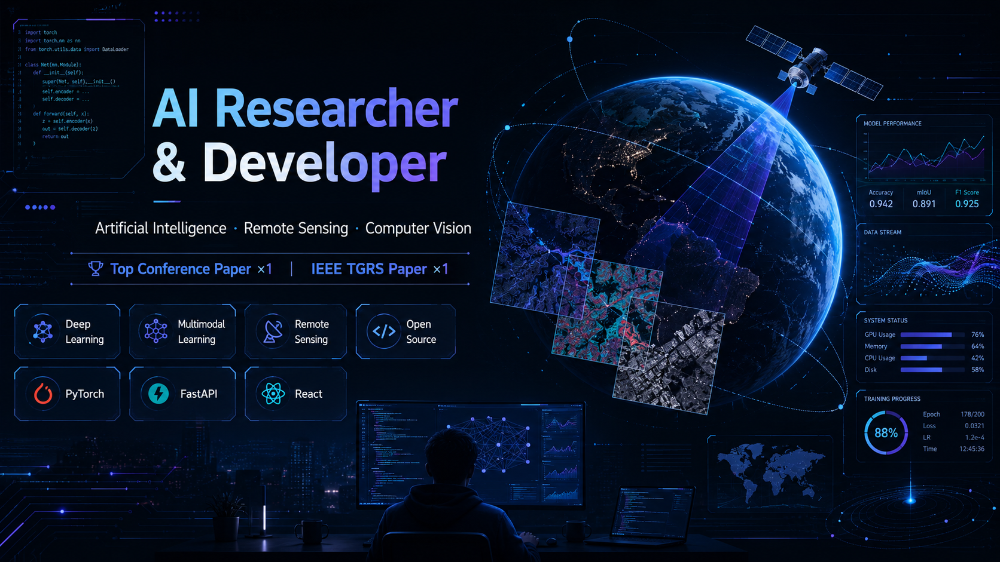

  

  <h1>
    
  </h1>

  

    
    
    
  

---

## 🧑‍🔬 About Me · 关于我

- 🛰️ AI Researcher & Developer focusing on **Remote Sensing · Computer Vision · Multimodal Learning**
- 📄 **1× Top Conference Paper** · **1× IEEE TGRS** journal paper
- 🏗️ Building research-grade segmentation networks and product-grade AI tools
- 🌱 Currently exploring **multi-agent learning systems** and **AI for K–12 classrooms**
- ⚡ Fun fact: pixel-art enthusiast — see my latest open-source classroom demo below 🎮

> 中文简介：AI 研究与工程双修，研究方向为 **遥感影像智能解译 / 建筑物提取 / 计算机视觉 / 多模态学习**；同时把模型与系统下沉到 K–12 课堂里，做能让小朋友尖叫的教学 Demo。

---

## 🛠️ Tech Stack · 技术栈

**AI / ML Core**

**Backend / Infra**

**Frontend / Product**

---

## 🚀 Featured Projects · 精选作品

<table>
  <tr>
    <td width="50%" valign="top">
      
       
      🛰️ <b>Remote Sensing</b> · 内容自适应建筑物分割网络。原创科研代码，支撑 IEEE TGRS 论文。
    </td>
    <td width="50%" valign="top">
      
       
      🎮 <b>AI × Education</b> · 像素风 AI 动物身份证设计工坊（小学英语 Farms 单元）。<a href="http://stgame.wanheit.com">Live Demo →</a>
    </td>
  </tr>
  <tr>
    <td width="50%" valign="top">
      
       
      🦅 <b>Multimodal</b> · Falcon-Perception / Falcon-OCR 推理 fork，研究 early-fusion、原生多模态自回归 Transformer。
    </td>
    <td width="50%" valign="top">
      
       
      🤖 <b>Multi-Agent</b> · Open Multi-Agent Interactive Classroom，沉浸式多 Agent 学习体验。
    </td>
  </tr>
</table>

---

## 📊 GitHub Stats · 数据看板

  
  

   

  

---

## 🏆 Trophies · 成就墙

  

---

## 🐍 Contribution Snake · 贡献蛇

  

---

  
    <i>"Train models, design systems, and enjoy pixel art." 🌾</i>
      
    Crafted with curiosity · Open to collaborations on remote-sensing, multimodal AI and ed-tech.
  

